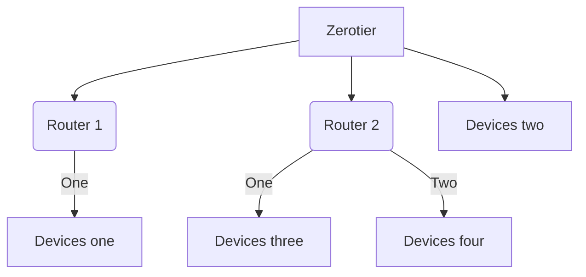

Setting of Zerotier

# Networking via Zerotier 

* 添加普通设备到Zerotier
* 添加路由设备到Zerotier
  * 在 Router1 上安装 Zerotier，并填写 network ID 加入ZeroTier 网络
  * 假设 ZeroTier 为 Router1 分   配的 IP 为 10.10.10.11
  * 在 ZeroTier 官网设置 Managed Routes 选项
    * networks/bits：填写需要被访问的网段，为192.168.10.1/24
    * （lan）：网络中接入 ZeroTier 的设备被分配的IP，为10.10.10.11
  * 配置 Router1 的防火墙

```bash
iptables -I FORWARD -i zt0 -j ACCEPT
iptables -I FORWARD -o zt0 -j ACCEPT
iptables -t nat -I POSTROUTING -o zt0 -j MASQUERADE
```



**注意事项**

* 组网的多个局域网，IP 段不能冲突，如拓扑图中 Router1 192.168.10.1/24 和 Router2 192.168.5.1/24 是不冲突的。

[Ref:ZeroTier 中阶教程](https://stray.love/jiao-cheng/zerotier-zhong-jie-jiao-cheng)